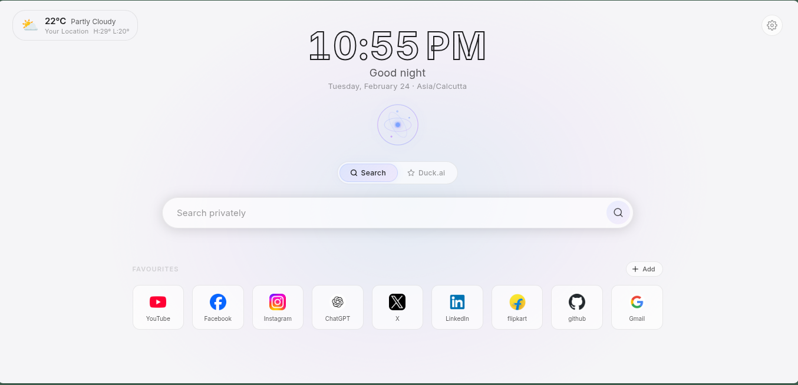
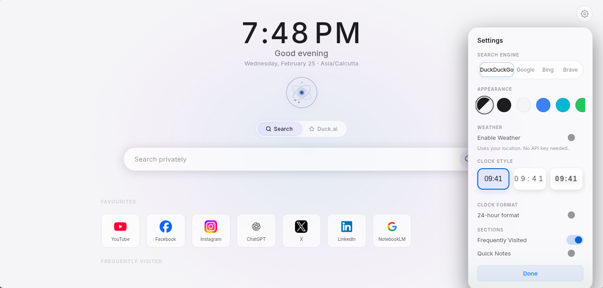
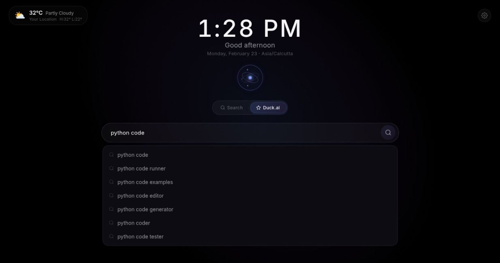
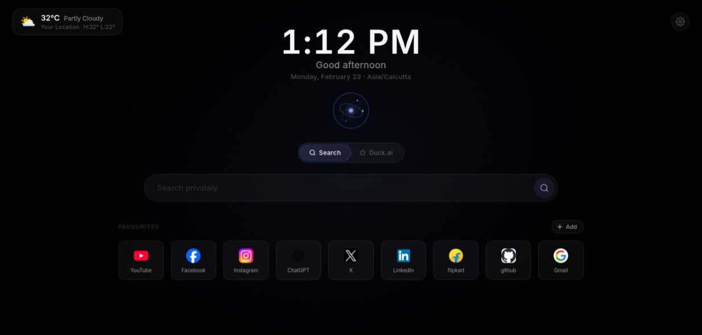

<div align="center">
  

  # New WEB

  **A premium, privacy-focused new tab experience with search, AI mode, weather, and favourite sites.**

    [](https://addons.mozilla.org/en-US/firefox/addon/new-web/)
</div>

---

## ✨ Features

- 🔒 **Privacy-focused Search**: Quick access to DuckDuckGo and Google search suggestions.
- 🤖 **AI Mode**: Seamless integration for AI-assisted queries right from your new tab.
- ⛅ **Weather Widget**: Real-time accurate weather updates using your local area.
- 🔖 **Favourite Sites**: Easy and quick access to your most visited and curated websites.
- 🎨 **Premium Aesthetic**: A beautifully crafted, modern, and clean interface that feels native and refined.

## 🖼️ Screenshots

<div align="center">
  
  <br/><br/>
  
  <br/><br/>
  
  <br/><br/>
  
</div>

## 🚀 Installation

### Using Firefox Add-ons (AMO)
*(Coming soon)*

### Developer Mode (Local Installation)

1. **Clone or download** this repository to your computer:
   ```bash
   git clone https://github.com/yourusername/New-WEB-firefox.git
   ```
2. Open **Firefox** and navigate to `about:debugging`
3. Click **This Firefox** on the left menu.
4. Click **Load Temporary Add-on...** and select any file inside the extension directory (like `manifest.json`).

## Usage

Once installed, simply open a new tab (`Ctrl+T` or `Cmd+T`)! 
You will immediately land on your **New WEB** experience, ready to browse quickly, efficiently, and stylishly.
