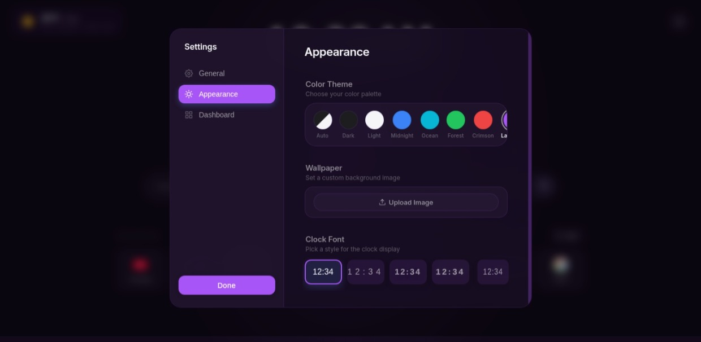

<div align="center">
  

  # New WEB

  **A premium, privacy-focused new tab experience with search, AI mode, weather, and favourite sites.**

   [](https://addons.mozilla.org/en-US/firefox/addon/new-web/)
  [](https://microsoftedge.microsoft.com/addons/detail/cdgkeoiilacohpjkdakhpelhenaajeia)

</div>

---

##  Features

-  **Privacy-focused Search**: Quick access to DuckDuckGo and Google search suggestions.
-  **AI Mode**: Seamless integration for AI-assisted queries right from your new tab.
-  **Weather Widget**: Real-time accurate weather updates using your local area.
-  **Favourite Sites**: Easy and quick access to your most visited and curated websites.
-  **Premium Aesthetic**: A beautifully crafted, modern, and clean interface that feels native and refined.

##  Screenshots

<div align="center">
  
  <br/><br/>
  
  <br/><br/>
  
  <br/><br/>
  
</div>

##  Installation

### Using the Chrome Web Store / Edge Add-ons
*(Coming soon)*

### Developer Mode (Local Installation)

1. **Clone or download** this repository to your computer:
   ```bash
   git clone https://github.com/yourusername/New-WEB-main.git
   ```
2. Open your browser's extensions page:
   - **Chrome**: Navigate to `chrome://extensions/`
   - **Edge**: Navigate to `edge://extensions/`
3. Enable **Developer mode**.
4. Click **Load unpacked** and select the directory containing the extension files.

## Usage

Once installed, simply open a new tab (`Ctrl+T` or `Cmd+T`)! 
You will immediately land on your **New WEB** experience, ready to browse quickly, efficiently, and stylishly.

---

## Contact

For support, feedback, or questions:

- Email: hydra007@duck.com  
- Telegram: https://t.me/Hydra_888  

---
